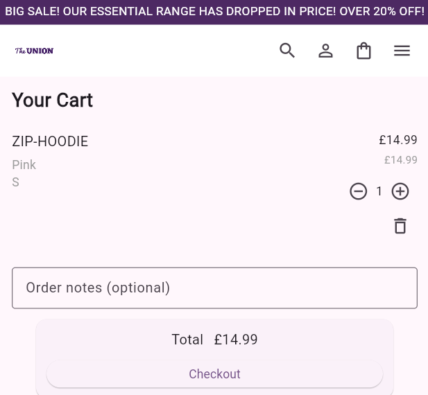
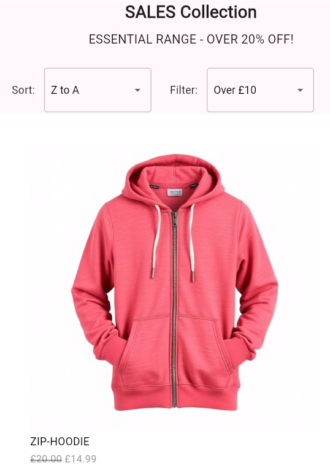
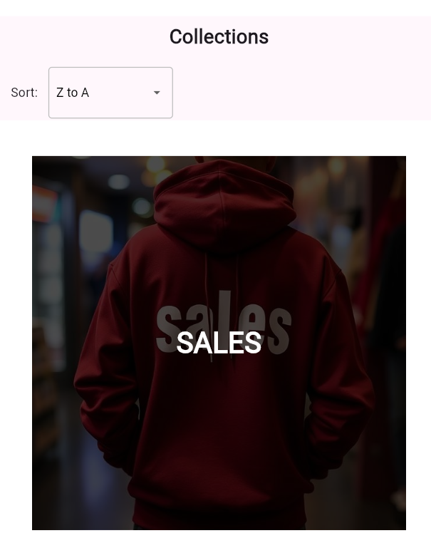
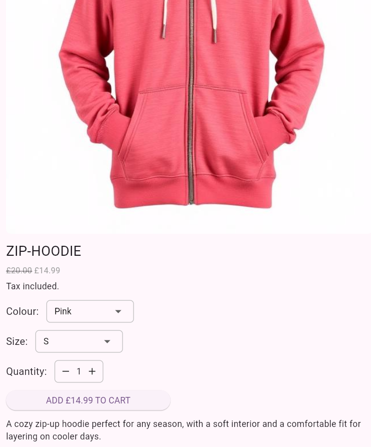

# Union Shop

Union Shop is a Flutter-based e-commerce demo app showcasing a small shop UI with product collections and cart management for a year 2 coursework.

**Quick snapshot**: a lightweight, cross-platform Flutter project (Android, iOS, web, desktop) used for learning and prototyping storefront flows made with the help of AI.

**Features**
- **Product collections**: Browse collections and product detail pages.
- **Cart**: Add/remove items and view cart totals.
- **Platform support**: Android, iOS, Web, Windows, Linux, macOS (as scaffolded by Flutter).

**Prerequisites**
- Flutter SDK installed and on your PATH. Verify with `flutter --version`.
- Android SDK / Xcode (for mobile builds) and desktop toolchains if you plan to run on those platforms.

**Getting Started**
1. Clone the repository:

```bash
git clone https://github.com/MJenkins2006/union_shop.git
cd union_shop
```

2. Get packages:

```powershell
flutter pub get
```

3. Run the app (select desired device):

```powershell
flutter run
```

4. Run tests with coverage:

```powershell
flutter test --coverage
```

**Project structure (high level)**
- `lib/` — application source code.
	- `main.dart` — app entrypoint.
	- `database.dart` — collections and product data.
	- `models/` — data models.
	- `views/` — UI screens and widgets.
		- `about_screen.dart` — About page: fake app details and creator/contact information.
		- `authentication.dart` — Authentication flows: sign-in / sign-up UI and helpers.
		- `cart_screen.dart` — Cart view: list items, change quantities, view totals and checkout summary.
        
		- `collection_screen.dart` — Single collection: shows products within a selected collection.
        
		- `collections_screen.dart` — Collections browse: lists available product collections.
        
		- `common_widgets.dart` — Shared widgets used across screens (product tiles, buttons, headers).
		- `home_screen.dart` — Home / landing screen with featured collections and product highlights.
		- `personalisation_about_screen.dart` — Details page describing personalization features.
		- `personalisation_screen.dart` — Personalisation settings UI for user preferences.
		- `product_screen.dart` — Product detail page with images, description, and add-to-cart action.
        
- `assets/` — images and other bundled assets.

**Contributing**
- Feel free to open issues or pull requests. Keep PRs focused and include a short description of changes.

**Troubleshooting**
- If you see build or dependency errors, run `flutter clean` then `flutter pub get` and try again.
- For platform-specific build issues, ensure the corresponding SDK/toolchain is installed and configured.

**License & Contact**
- This repository does not include a license file. Add a license if you plan to publish or accept contributions.
- For questions, open an issue in the repository.

**Creator**
- MJenkins2006